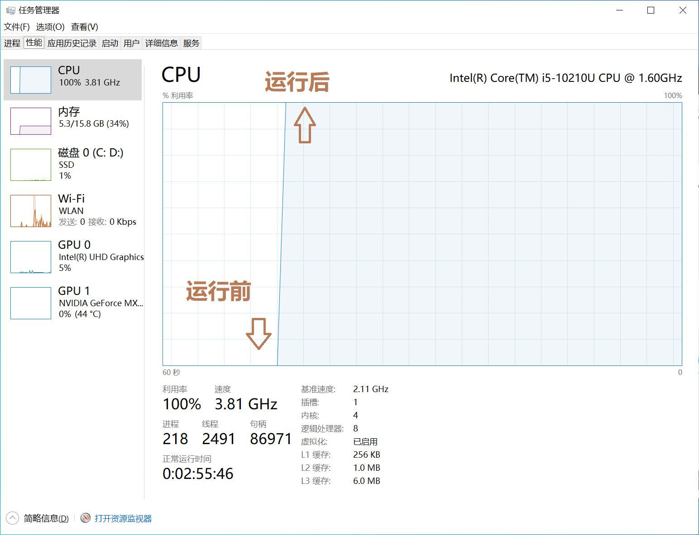
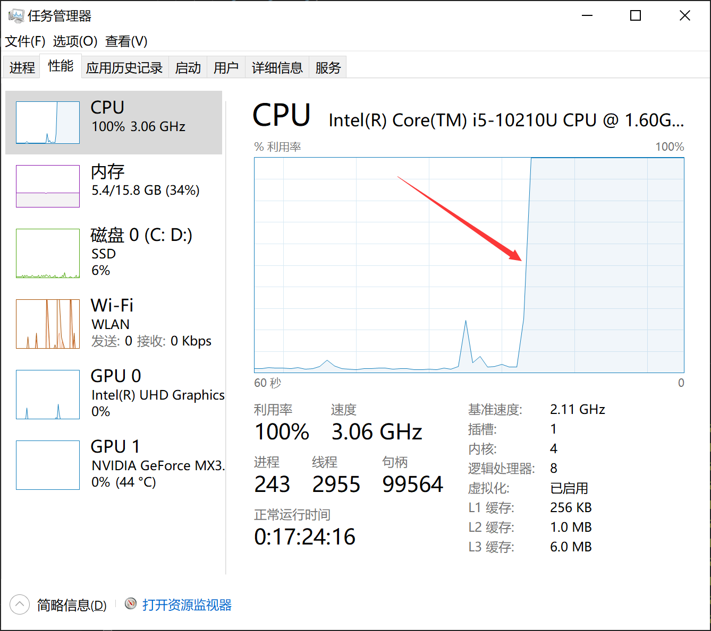

> 挑战一：写一个程序，运行该进程时，你的电脑整体 CPU 利用率保持在 100%
> 示例效果如
> 

Transaltion: Write a program and make your CPU's usage rate 100%.

Code is in `main.cpp`. Remember to not compile it with O2 optimization, or my dead cycle will be eliminated.

Final effect:

